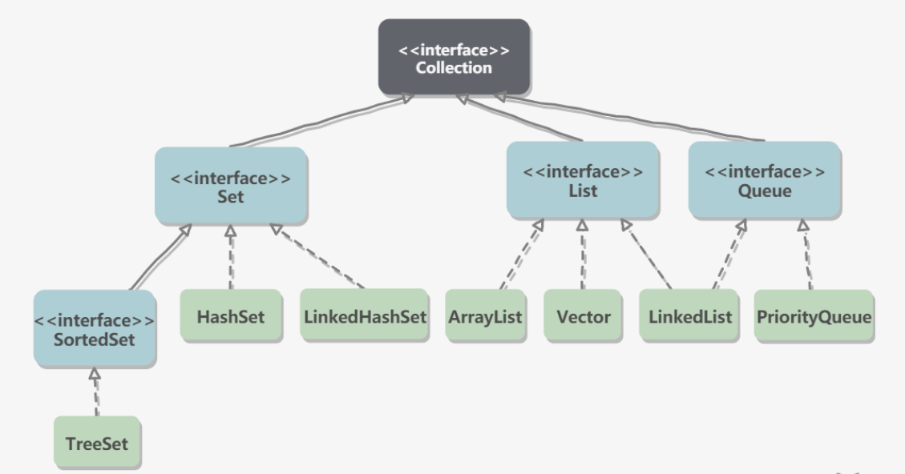
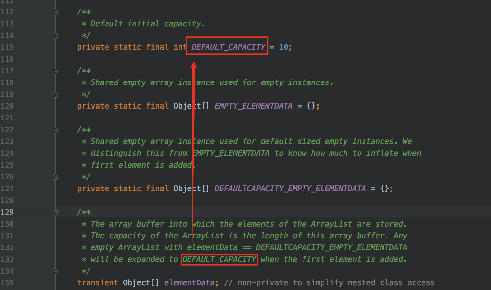
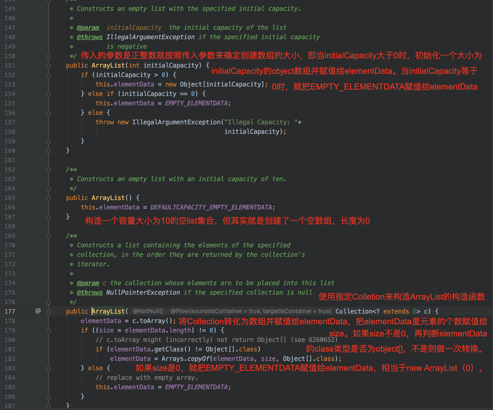
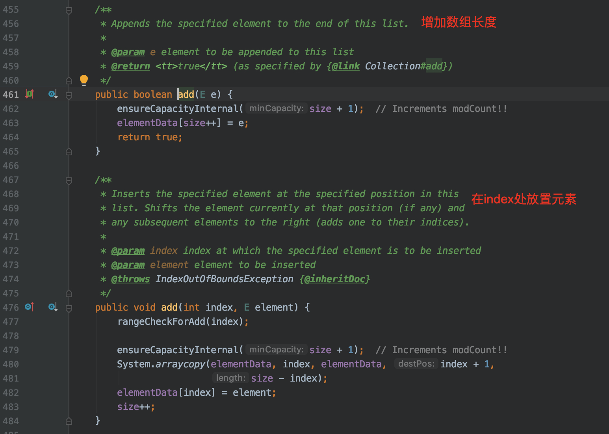
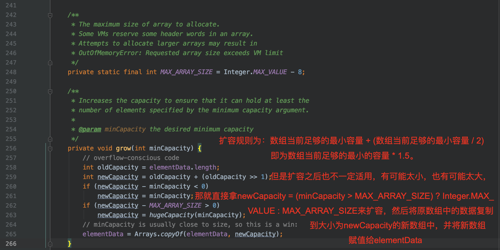

# Collection<interface>集合之List集合

Collection集合概览图：

我们可以看下 `List` 部分。

## 1. List

- ### ArrayList：基于动态数组实现，支持随机访问。

- ### Vector：和 `ArrayList` 相似，但它是`线程安全`的。

- ### LinkedList：基于双向链表实现，只能顺序访问，但是可以快速的在链表中插入和删除。不仅如此，`LinkedList` 还可以用作栈、队列和双向队列。

## 2. ArrayList 的特点

- #### ArrayList的底层数据结构是数组，所以查找遍历快，增删慢。

- #### ArrayList可随着元素的增长而自动扩容，正常扩容的话，每次扩容到原来的1.5倍。

- #### ArrayList的线程是不安全的。

## 3. ArrayList 的扩容机制

我们都知道，数组是不能扩容的，`ArrayList` 可以扩容，但是 `ArrayList` 底层就是数组，它是怎么进行扩容的呢？

1. `ArrayList` 扩容实现步骤

   - 扩容：把原来的数组复制到另外一个内存空间更大的数组中；
   -  添加新元素：把新元素添加到扩容以后的数组中；

2. 源码分析

   关键属性分析：

   - 构建一个初始容量为10的空列表

     		

     - 第三个属性大致意思是一开始初始化的时候，会是一个共享的类变量，也就是一个object空数组，共享的空数组实例用于默认大小的空实例。第一次添加元素的时候就知道elementData是从空的构造函数or有参的构造函数被初始化的。以便我们知道怎么扩容，扩容多少。  第四个属性大致意思是elementData是存储ArrayList的数据的，ArrayList的容量就是这个数组缓冲区的长度。当第一次add的时候，这个数组就会被初始化一个大小为10的数组。使用了transient，使该属性不会被序列化。

   - 解析ArrayList的三个构造方法

   

   

   - 分析常用方法

   

   通过ensureCapacityInternal(size + 1);来保证底层object[]数组有足够的空间存放添加的数据，然后将添加的数据存放到数组对应的位置上。

   

   主要就是确定Object[]足够存放添加数据的最小容量，然后通过grow（int minCapacity）来进行数组扩容。

   

   要注意一下int newCapacity = oldCapacity + (oldCapacity >> 1);  oldCapacity >> 1是右移运算符，原来长度的一半，再加上原长度就是每次扩容是原来的1.5倍；之前所有都是确定新数组的长度，确认之后就是将老数据复制到新数组中，elementData = Arrays.copyOf(elementData, newCapacity); 

## 4. LinkedList 的扩容机制

### 1. `LinkedList` 是一个继承于 `AbstractSequentialList` 的双向链表。

### 2. 由于他的底层是用双向链表实现的，没有初始化大小，所以没有油扩容机制，就是一直在前面或者是后面新增就好。

## 5. 二者区别

#### 1. 二者的顶层接口都是 `Collection`。

#### 2. ArrayList是基于数组实现的，查询速度较快，`LinkedList` 是双向链表，可以从头插入也可以从末尾插入，所以在增加和删除的时候比较快，是基于链式存储结构的。

#### 3. `LinkedList` 是离散空间所以不需要主动扩容，而 `ArrayList` 是连续空间，内存空间不足时，会主动扩容。

#### 4.两者都不是线程安全的。