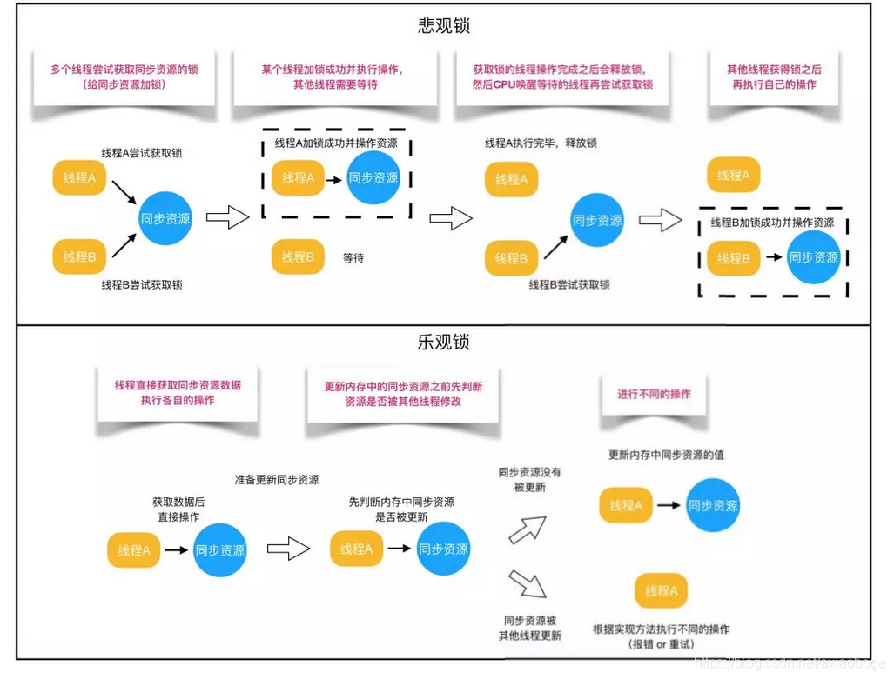
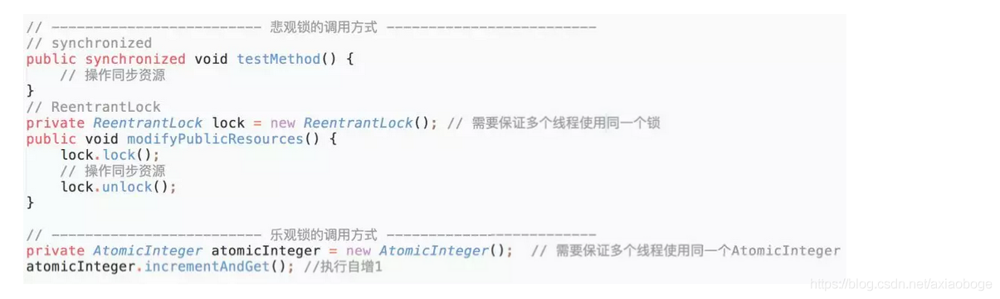
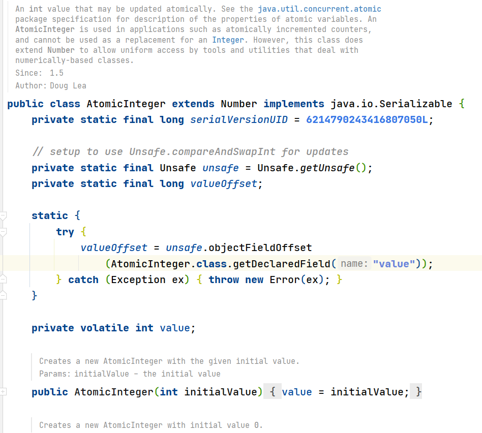
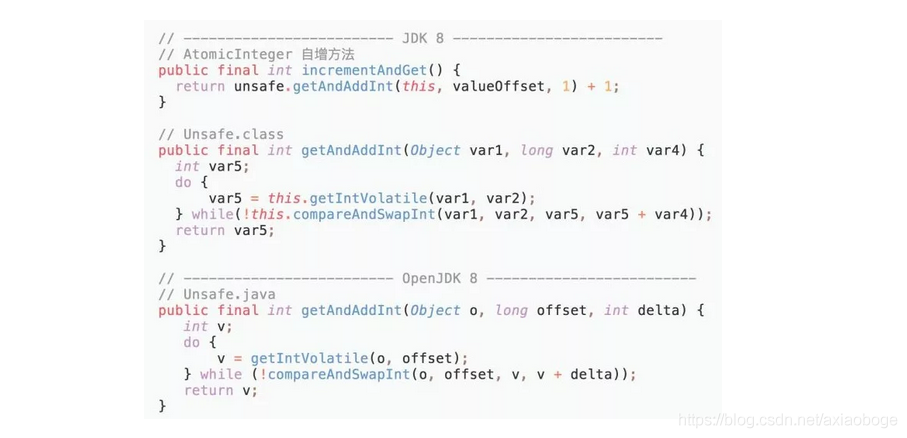

## 乐观锁 vs 悲观锁

> 乐观锁 与悲观锁市一种广义上的概念。体现了看待线程同步的不同角度。在Java和数据库中都有次此概念对应的实际应用。

### 1. `悲观锁`概念

​		对于同一个数据的并发操作，悲观锁认为自己在使用数据的时候一定有别的线程来修改数据，因此在获取数据的时候会先加锁，确保数据不会被别的线程修改。Java中，`Synchronized`关键字和`Lock`的实现类都是悲观锁。

### 2. `乐观锁`概念

​		乐观锁认为自己在使用数据时，不会有别的线程修改数据，所以不会添加锁，只是在更新数据的时候去判断之前有没有别的线程更新了这个数据。如果这个数据没有被更新，当前线程将自己修改的数据成功写入。如果数据被其他线程更新，则根据不同的实现方式执行不同的操作（例如报错或者自动重试）。

乐观锁在Java中是通过使用无锁编程来实现，最常采用的是`CAS算法`，Java原子类的递增操作就是通过`CAS自旋`实现的。

根据从上面的概念描述我们可以发现：

- 悲观锁适合写操作多的场景，先加锁可以保证写操作时的数据正确。
- 乐观锁适合度操作多的场景，不加锁的特点能够使其读操作的性能大幅提升。

光说概念有些抽象，我们来看下乐观锁和悲观锁的的调用方式实例：

通过调用法师示例，我们可以发现悲观锁基本都是在显示的锁定之后再操作同步资源，而乐观锁则直接去操作同步资源。那么，为何乐观锁能够做到不锁定同步资源也可以正确的实现线程同步呢？我们通过介绍乐观锁的主要实现方式“CAS”的技术实现原理来解答这个困惑。

### 3. 何为 “CAS” ？有何优缺点 ？

> `CAS全称：Compare And Swap（比较与交换）`，是一种无锁算法。在不使用锁（没有线程被阻塞）的情况下实现多线程之前的变量同步。java.util.concurrent包中的原子类就是通过CAS来实现了乐观锁。
>
> CAS算法涉及到三个操作数：
>
> - 需要读写的内存值V
> - 进行比较的值A
> - 要写入的新值B
>
> **`当且仅当V的值等于A时，CAS通过原子方式用新值B来更新V的值（“比较+更新”整体是一个原子操作），否则不会执行任何操作。一般情况下，“更新”是一个不断重试的操作。`**

之前提到java.util.concurrent包中的原子类，就是通过CAS来实现了乐观锁，那么我们进入原子类AtomicInteger的源码，看一下AtomicInteger的定义：

> 根据定义我们可以看出各属性的作用：
>
> - unsafe： 获取并操作内存的数据。
> - valueOffset： 存储value在AtomicInteger中的偏移量。
> - value： 存储AtomicInteger的int值，该属性需要借助volatile关键字保证其在线程间是可见的。

接下来，我们查看AtomicInteger的自增函数incrementAndGet()的源码时，发现自增函数底层调用的是unsafe.getAndAddInt()。但是由于JDK本身只有Unsafe.class，只通过class文件中的参数名，并不能很好的了解方法的作用，所以我们通过OpenJDK 8 来查看Unsafe的源码：

根据OpenJDK 8的源码我们可以看出，getAndAddInt()循环获取给定对象o中的偏移量处的值v，然后判断内存值是否等于v。如果相等则将内存值设置为 v + delta，否则返回false，继续循环进行重试，直到设置成功才能退出循环，并且将旧值返回。整个“比较+更新”操作封装在compareAndSwapInt()中，在JNI里是借助于一个CPU指令完成的，属于原子操作，可以保证多个线程都能够看到同一个变量的修改值。

后续JDK通过CPU的cmpxchg指令，去比较寄存器中的 A 和 内存中的值 V。如果相等，就把要写入的新值 B 存入内存中。如果不相等，就将内存值 V 赋值给寄存器中的值 A。然后通过Java代码中的while循环再次调用cmpxchg指令进行重试，直到设置成功为止。

### 4. CAS虽然很高效，但是它也存在三大问题，这里也简单说一下：

1. ABA问题。CAS需要在操作值的时候检查内存值是否发生变化，没有发生变化才会更新内存值。但是如果内存值原来是A，后来变成了B，然后又变成了A，那么CAS进行检查时会发现值没有发生变化，但是实际上是有变化的。ABA问题的解决思路就是在变量前面添加版本号，每次变量更新的时候都把版本号加一，这样变化过程就从“A－B－A”变成了“1A－2B－3A”。

   JDK从1.5开始提供了AtomicStampedReference类来解决ABA问题，具体操作封装在compareAndSet()中。compareAndSet()首先检查当前引用和当前标志与预期引用和预期标志是否相等，如果都相等，则以原子方式将引用值和标志的值设置为给定的更新值。

2. 循环时间长开销大。CAS操作如果长时间不成功，会导致其一直自旋，给CPU带来非常大的开销。

3. 只能保证一个共享变量的原子操作。对一个共享变量执行操作时，CAS能够保证原子操作，但是对多个共享变量操作时，CAS是无法保证操作的原子性的。

Java从1.5开始JDK提供了AtomicReference类来保证引用对象之间的原子性，可以把多个变量放在一个对象里来进行CAS操作。