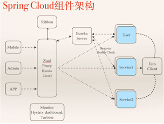

# SpringCloud 知识总结

## 1、什么是SpringCloud？

> SpringCloud是基于SpringBoot基础上开发的微服务框架，SpringCloud是一套目前非常完整的微服务解决方案框架，其内容包含：`服务治理`，`注册中心`，`配置管理`，`断路器`，`智能路由`，`微代理`，`控制总线`，`全局锁`，`分布式会话`等。

SpringCloud包含众多的子项目

SpringCloud config 分布式配置中心

SpringCloud Netflix 核心组件

​                      Eureka:服务治理 注册中心

​                      Hystrix:服务保护框架

​                      Ribbon:客户端负载均衡器

​                      Feign：基于ribbon和hystrix的声明式服务调用组件

​                      Zuul: 网关组件,提供智能路由、访问过滤等功能。

## 2、SpringCloud 组件都有哪些？

- ### SpringCloud Eureka：服务治理，注册中心  

  - 服务治理：在传统rpc远程调用中，服务与服务依赖关系，管理比较复杂，所以需要使用服务治理，管理服务与服务之间依赖关系，可以实现服务调用、负载均衡、容错等，实现服务发现与注册。

  - 注册中心：在服务注册与发现中，有一个注册中心，当服务器启动的时候，会把当前自己服务器的信息 比如 服务地址通讯地址等以别名方式注册到注册中心上。

     另一方（消费者|服务提供者），以该别名的方式去注册中心上获取到实际的服务通讯地址，让后在实现rpc调用。

- 这里是可以使用`ZooKeeper`来`替换`掉Eureka的。

  - Zookeeper是一个分布式协调工具，可以实现服务注册与发现、注册中心、消息中间件、分布式配置中心等。
  - Kafka：

## 3、分别说说平时都用到哪些？

