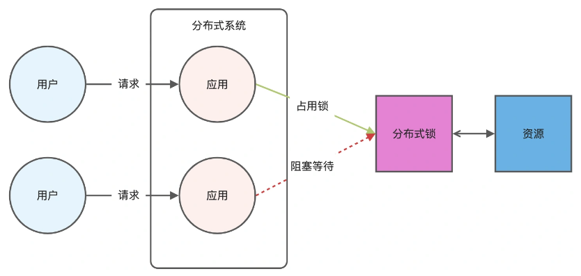

## Redis 如何实现分布式锁？

> 很多新手将 `分布式锁` 和 `分布式事务` 混淆，个人理解：
>
> - `锁`： 是用于解决多程序并发争夺某一共享资源；
> - `事务`： 是用于保障一系列操作执行的一致性。
>
> 这次把几种分布式锁的方案说一说。



### 1. 定义

在传统单体架构中，我们最常见的锁是 jdk 的锁。因为`线程是操作系统能够运行调度的最小单位`，在java多线程开发时，就难免涉及到不同线程竞争同一个进程下的资源。jdk 库给我们提供了 `synchronized`、`Lock` 和并发包 `java.util.concurrent.*`  等。但是它们都统一的限制，竞争资源的线程，都是运行在同一个 JVM 进程下，在分布式架构中，不同JVM 进程是无法使用该锁的。

为了防止分布式系统中的多个进程之间相互干扰，我们需要一种分布式协调技术来对这些进程进行调度。而这个分布式协调技术的核心就是来实现这个`分布式锁`。

:chestnut: 举个栗子：

经典“超卖”的例子，某个电商项目中抢购100件库存的商品，抢购接口的逻辑可简单分为：1、查询库存是否大于零；2、当库存大于零时，购买商品。当只剩1件库存时，A用户和B用户都同时执行了第一步，查询库存都为1件，然后都执行购买操作。当他们购买完成，发现库存是 -1 件了。我们可以在java代码中将“查询库存”和“减库存”的操作加锁，保障A用户和B用户的请求无法并发执行。但万一我们的接口服务是个集群服务，A用户和B用户的请求分别被负载均衡转发到不同的Jvm进程上，那还是解决不了问题。

### 2. 分布式锁对比

通过前面的例子可以知道，协调解决分布式锁的资源，肯定不能是 JVM 进程级别的资源，而应该是某个可以共享的外部资源。

> #### 三种实现方式：
>
> 1、数据库锁
>
> 2、基于 Zookeeper 的分布式锁
>
> 3、基于 Redis 的分布式锁

##### 1) **数据库锁**：竞争表级资源或行级资源

这种方式很容易被我们想到，把竞争的资源放在数据库中，利用数据库锁来实现资源竞争。或许在这里能找到想象不到的内容[《数据库事务和锁》]()。

例如：（1）**悲观锁实现**：查询库存商品的sql可以加上 "`FOR UPDATE`" 以实现排他锁，并且将“查询库存”和“减库存”打包成一个事务 `COMMIT`，在A用户查询和购买完成之前，B用户的请求都会被阻塞住。

（2）**乐观锁实现**：在库存表中加上版本号字段来控制。或者更简单的实现是，当每次购买完成后发现库存小于零了，回滚事务即可。

##### 2) **Zookeeper的分布式锁**：竞争文件资源

实现分布式锁，ZooKeeper是专业的。它类似于一个文件系统，通过多系统竞争文件系统上的文件资源，起到分布式锁的作用。具体的实现方式，了解Zookeeper相关，可以移步[《zookeeper的开发应用》]()。

##### 3) **Redis的分布式**：为了竞争键值资源

Redis 的分布式锁简单来说就是通过 `SETNX` 竞争键的值。这也是本文的核心内容。

【总结】以上分布式锁的三种实现方式，都是通过竞争程序外部的共享资源，进而来实现分布式锁。

> #### 对比

不过在分布式锁的领域，还是 Zookeeper 更专业。Redis 本质上也是数据库，所有其它两种方案都是“兼职”实现分布式锁的，效果上没有 Zookeeper 好。

1. 性能消耗小：当真的出现并发锁竞争时，数据库或redis的实现基本都是通过阻塞，或不断重试获取锁，有一定的性能消耗。而zookeeper锁是通过注册监听器，当某个程序释放锁是，下一个程序监听到消息再获取锁。
2. 锁释放机制完善：如果是redis获取锁的那个客户端bug了或者挂了，那么只能等待超时时间之后才能释放锁；而zk的话，因为创建的是临时znode，只要客户端挂了，znode就没了，此时就自动释放锁。
3. 集群的强一致性：众所周知，zookeeper是典型实现了 CP 事务的案例，集群中永远由Leader节点来处理事务请求。而redis其实是实现 AP 事务的，如果master节点故障了，发生主从切换，此时就会有可能出现锁丢失的问题。

> #### 锁的必要条件

另外为了确保分布式锁可用，我们至少要确保锁的实现同时满足以下几个条件：

1. 互斥性。在任意时刻，只有一个客户端能持有锁。
2. 不会发生死锁。即使有一个客户端在持有锁的期间崩溃而没有主动解锁，也能保证后续其他客户端能加锁。
3. 解铃还须系铃人。加锁和解锁必须是同一个客户端，客户端自己不能把别人加的锁给解了。


### 3. Redis实现分布式锁

#### 3.1. 加锁

> **正确的加锁**

```java
public class RedisTool {

    private static final String LOCK_SUCCESS = "OK";
    private static final String SET_IF_NOT_EXIST = "NX";
    private static final String SET_WITH_EXPIRE_TIME = "PX";

    /**
     * 尝试获取分布式锁
     * @param jedis Redis客户端
     * @param lockKey 锁
     * @param requestId 请求标识
     * @param expireTime 超期时间
     * @return 是否获取成功
     */
    public static boolean tryGetDistributedLock(Jedis jedis, String lockKey, String requestId, int expireTime) {

        String result = jedis.set(lockKey, requestId, SET_IF_NOT_EXIST, SET_WITH_EXPIRE_TIME, expireTime);

        if (LOCK_SUCCESS.equals(result)) {
            return true;
        }
        return false;
    }
}
```

以看到，我们加锁就一行代码：`jedis.set(String key, String value, String nxxx, String expx, int time)`，这个set()方法一共有五个形参：

1. **key**：我们使用key来当锁，因为key是唯一的。
2. **value**：我们传的是requestId，很多童鞋可能不明白，有key作为锁不就够了吗，为什么还要用到value？原因就是我们在上面讲到可靠性时，分布式锁要满足第四个条件解铃还须系铃人，通过给value赋值为requestId，我们就知道这把锁是哪个请求加的了，在解锁的时候就可以有依据。requestId可以使用UUID.randomUUID().toString()方法生成。
3. **Nxxx**：这个参数我们填的是NX，意思是SET IF NOT EXIST，即当key不存在时，我们进行set操作；若key已经存在，则不做任何操作；
4. **EXPX**：这个参数我们传的是PX，意思是我们要给这个key加一个过期的设置，具体时间由第五个参数决定。
5. **time**：与第四个参数相呼应，代表key的过期时间。

总的来说，执行上面的set()方法就只会导致两种结果：

- 当前没有锁（key不存在），那么就进行加锁操作，并对锁设置个有效期，同时value表示加锁的客户端。
- 已有锁存在，不做任何操作。

> **不推荐的加锁方式（不推荐！！！）**

我看过很多博客中，都用下面的方式来加锁，即setnx和getset的配合，手动来维护键的过期时间。

```java
public static boolean wrongGetLock2(Jedis jedis, String lockKey, int expireTime) {

    long expires = System.currentTimeMillis() + expireTime;
    String expiresStr = String.valueOf(expires);

    // 如果当前锁不存在，返回加锁成功
    if (jedis.setnx(lockKey, expiresStr) == 1) {
        return true;
    }

    // 如果锁存在，获取锁的过期时间
    String currentValueStr = jedis.get(lockKey);
    if (currentValueStr != null && Long.parseLong(currentValueStr) < System.currentTimeMillis()) {
        // 锁已过期，获取上一个锁的过期时间，并设置现在锁的过期时间
        String oldValueStr = jedis.getSet(lockKey, expiresStr);
        if (oldValueStr != null && oldValueStr.equals(currentValueStr)) {
            // 考虑多线程并发的情况，只有一个线程的设置值和当前值相同，它才有权利加锁
            return true;
        }
    }
    // 其他情况，一律返回加锁失败
    return false;
}
```

表面上来看，这段代码也是实现分布式锁的，而且代码逻辑和上面的差不多，但是有下面几个问题：

1. 由于是客户端自己生成过期时间，所以需要强制要求分布式下每个客户端的时间必须同步。
2. 当锁过期的时候，如果多个客户端同时执行jedis.getSet()方法，那么虽然最终只有一个客户端可以加锁，但是这个客户端的锁的过期时间可能被其他客户端覆盖。
3. 锁不具备拥有者标识，即任何客户端都可以解锁。

网上的这类代码可能是基于早期jedis的版本，当时有很大的局限性。Redis 2.6.12以上版本为set指令增加了可选参数，像前面说的`jedis.set(String key, String value, String nxxx, String expx, int time)`的api，可以把 `SETNX` 和 `EXPIRE` 打包在一起执行，并且把过期键的解锁交给redis服务器去管理。因此实际开发过程中，大家不要再用这种比较原始的方式加锁了。

#### 3.2. 解锁

> **正确的加锁**

```java
public class RedisTool {

    private static final Long RELEASE_SUCCESS = 1L;

    /**
     * 释放分布式锁
     * @param jedis Redis客户端
     * @param lockKey 锁
     * @param requestId 请求标识
     * @return 是否释放成功
     */
    public static boolean releaseDistributedLock(Jedis jedis, String lockKey, String requestId) {

        String script = "if redis.call('get', KEYS[1]) == ARGV[1] then return redis.call('del', KEYS[1]) else return 0 end";
        Object result = jedis.eval(script, Collections.singletonList(lockKey), Collections.singletonList(requestId));

        if (RELEASE_SUCCESS.equals(result)) {
            return true;
        }
        return false;
    }
}
```

首先获取锁对应的value值，检查是否与requestId相等，如果相等则删除锁（解锁）。那么为什么要使用Lua语言来实现呢？因为要确保上述操作是原子性的。在之前[《Redis的线程模型和事务》](https://segmentfault.com/a/1190000037434936)文章中，我们通过事务的方式保证一系列操作指令的原子性，使用Lua脚本也同样可以实现类似的效果。

为什么要保证原子性呢？假如A请求在获取锁对应的value值验证requestId相等后，下达删除指令。但是由于网络等原因，删除的指令阻塞住了。而此时锁因为超时自动解锁了，并且B请求获取到了锁，重新加锁。这时候A请求到删除指令执行了，结果把B请求好不容易获取到的锁给删了。

#### 3.3. Lua 脚本

Redis命令的计算能力并不算很强大，使用Lua语言则可以在很大程度上弥补Redis的这个不足。在Redis中，执行Lua语言是原子性，也就是说Redis执行Lua的时候是不会被中断的，具备原子性，这个特性有助于Redis对并发数据一致性的支持。

Redis支持两种方法运行脚本，一种是直接输入一些Lua语言的程序代码，另一种是将Lua语言编写成文件。在实际应用中，一些简单的脚本可以采取第一种方式，对于有一定逻辑的一般采用第二种。而对于采用简单脚本的，Redis支持缓存脚本，只是它会使用SHA-1算法对脚本进行签名，然后把SHA-1标识返回，只要通过这个标识运行就可以了。

> **redis中执行lua**

这里就简单介绍，直接输入一些Lua语言的程序代码的方式，可在redis-cli中执行下列：

```lua
eval lua-script key-num [key1 key2 key3 ....] [value1 value2 value3 ....]

--示例1 
eval "return 'Hello World'" 0
--示例2
eval "redis.call('set',KEYS[1],ARGV[1])" 1 lua-key lua-value
```

- **eval** 代表执行Lua语言的命令。
- **lua-script** 代表Lua语言脚本。
- **key-num** 表示参数中有多少个key，需要注意的是Redis中key是从1开始的，如果没有key的参数，那么写0。
- **[key1 key2 key3…]** 是key作为参数传递给Lua语言，也可以不填，但是需要和key-num的个数对应起来。
- **[value1 value2 value3 …]** 这些参数传递给Lua语言，他们是可填可不填的。

> **lua中调用redis**

在Lua语言中采用redis.call 执行操作：

```scilab
redis.call(command,key[param1, param2…])

--示例1
eval "return redis.call('set','foo','bar')" 0
--示例2
eval "return redis.call('set',KEYS[1],'bar')" 1 foo
```

- **command** 是命令，包括set、get、del等。
- **key** 是被操作的键。
- **param1,param2…** 代表给key的参数。

例如，实现一个getset的lua脚本
getset.lua

```lua
local key = KEYS[1]
local newValue = ARGV[1]
local oldValue = redis.call('get', key)
redis.call('set', key, newValue)
return oldValue
```

#### 3.4. 局限性和改进

前面我们说过，在Redis集群中，分布式锁的实现存在一些局限性，当主从替换时难以保证一致性。

> **现象**

在redis sentinel集群中，我们具有多台redis，他们之间有着主从的关系，例如一主二从。我们的set命令对应的数据写到主库，然后同步到从库。当我们申请一个锁的时候，对应就是一条命令 `setnx mykey myvalue` ，在 redis sentinel 集群中，这条命令先是落到了主库。假设这时主库 down了，而这条数据还没来得及同步到从库，sentinel将从库中的一台选举为主库了。这时，我们的新主库中并没有mykey这条数据，若此时另外一个 client 执行 setnx mykey hisvalue , 也会成功，即也能得到锁。这就意味着，此时有两个client获得了锁。这不是我们希望看到的，虽然这个情况发生的记录很小，只会在主从failover的时候才会发生，大多数情况下、大多数系统都可以容忍，但不是所有的系统都能容忍这种瑕疵。

> **解决**

为了解决故障转移情况下的缺陷，Antirez 发明了 `Redlock 算法`。使用redlock算法，需要多个redis实例，加锁的时候，它会向多半节点发送 `setex mykey myvalue` 命令，只要**过半节点成功了，那么就算加锁成功了**。这和zookeeper的实现方案非常类似，**zookeeper集群的leader广播命令时，要求其中必须有过半的 follower 向 leader反馈 ACK 才生效**。

在实际工作中使用的时候，我们可以选择已有的开源实现，python有redlock-py，java 中有 **Redisson redlock**。

redlock确实解决了上面所说的“不靠谱的情况”。但是，它解决问题的同时，也带来了代价。你需要多个redis实例，你需要引入新的库 代码也得调整，性能上也会有损。所以，果然是不存在“完美的解决方案”，我们更需要的是能够根据实际的情况和条件把问题解决了就好。


----

参考文章：https://segmentfault.com/a/1190000037798450

https://www.cnblogs.com/xiaolincoding/p/16517673.html
