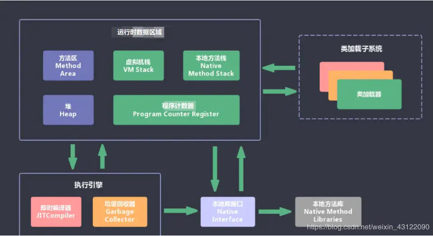

[toc]

# Interview FAQ

## Chatpter 1 项目介绍

## Chatpter 2 技术点考察

### 1. JVM 部分

#### :computer: JVM 内存模型

##### 1.1 JVM的内存是哪些部分组成的？运行的流程是什么？谈谈你的理解？



- **JVM包含两个子系统和两个组件**: 两个子系统为Class loader(类装载)、Execution engine(执行引 擎)； 两个组件为Runtime data area(运行时数据区)、Native Interface(本地接口)。 Class loader(类装载)：根据给定的全限定名类名(如：java.lang.Object)来装载class文件到 Runtime data area中的method area。 Execution engine（执行引擎）：执行classes中的指令。 Native Interface(本地接口)：与native libraries交互，是其它编程语言交互的接口。 Runtime data area(运行时数据区域)：这就是我们常说的JVM的内存。 
- **流程** ：首先通过编译器把 Java 代码转换成字节码，类加载器（ClassLoader）再把字节码加载到 内存中，将其放在运行时数据区（Runtime data area）的方法区内，而字节码文件只是 JVM 的一 套指令集规范，并不能直接交给底层操作系统去执行，因此需要特定的命令解析器执行引擎 （Execution Engine），将字节码翻译成底层系统指令，再交由 CPU 去执行，而这个过程中需要 调用其他语言的本地库接口（Native Interface）来实现整个程序的功能。

##### 1.2 谈谈JVM运行时数据区？

- Java 虚拟机在执行 Java 程序的过程中会把它所管理的内存区域划分为若干个不同的数据区域。这 些区域都有各自的用途，以及创建和销毁的时间，有些区域随着虚拟机进程的启动而存在，有些区 域则是依赖线程的启动和结束而建立和销毁。Java 虚拟机所管理的内存被划分为如下几个区域：

  `简单的说就是我们java运行时的东西是放在那里的。`


- 程序计数器（Program Counter Register）：当前线程所执行的字节码的行号指示器，字节码解 析器的工作是通过改变这个计数器的值，来选取下一条需要执行的字节码指令，分支、循环、跳 转、异常处理、线程恢复等基础功能，都需要依赖这个计数器来完成； 

  `为什么要线程计数器？因为线程是不具备记忆功能`

- Java 虚拟机栈（Java Virtual Machine Stacks）：每个方法在执行的同时都会在Java 虚拟机栈中创 建一个栈帧（Stack Frame）用于存储局部变量表、操作数栈、动态链接、方法出口等信息； 

  `栈帧就是Java虚拟机栈中的下一个单位 `

- 本地方法栈（Native Method Stack）：与虚拟机栈的作用是一样的，只不过虚拟机栈是服务 Java  方法的，而本地方法栈是为虚拟机调用 Native 方法服务的； 

  `Native 关键字修饰的方法是看不到的，Native 方法的源码大部分都是 C和C++ 的代码 `

- Java 堆（Java Heap）：Java 虚拟机中内存最大的一块，是被所有线程共享的，几乎所有的对象实 例都在这里分配内存；

- 方法区（Methed Area）：用于存储已被虚拟机加载的类信息、常量、静态变量、即时编译后的 代码等数据。 后面有详细的说明JVM 运行时数据区

##### 1.3 你能给我详细的介绍Java堆吗?（重点理解）

- java堆（Java Heap）是java虚拟机所管理的内存中最大的一块，是被所有线程共享的一块内存区 域，在虚拟机启动时创建。此内存区域的唯一目的就是存放对象实例。 
- 在Java虚拟机规范中的描述是：所有的对象实例以及数组都要在堆上分配。 
- java堆是垃圾收集器管理的主要区域，因此也被成为“GC堆”。 
- 从内存回收角度来看java堆可分为：新生代和老生代。 
- 从内存分配的角度看，线程共享的Java堆中可能划分出多个线程私有的分配缓冲区。 
- 无论怎么划分，都与存放内容无关，无论哪个区域，存储的都是对象实例，进一步的划分都是为了 更好的回收内存，或者更快的分配内存。 
- 根据Java虚拟机规范的规定，java堆可以处于物理上不连续的内存空间中。当前主流的虚拟机都是 可扩展的（通过 -Xmx 和 -Xms 控制）。如果堆中没有内存可以完成实例分配，并且堆也无法再扩 展时，将会抛出OutOfMemoryError异常。

##### 1.4 堆栈的区别是什么？

| 对比              | JVM堆                                                        | JVM栈                                                        |
| ----------------- | ------------------------------------------------------------ | ------------------------------------------------------------ |
| 物 理 地 址       | 堆的物理地址分配对对象是不连续的。因此性能慢些。在 GC的时候也要考虑到不连续的分配，所以有各种算法。比 如，标记-消除，复制，标记-压缩，分代（即新生代使用 复制算法，老年代使用标记——压缩） | 栈使用的是数据结构 中的栈，先进后出的 原则，物理地址分配 是连续的。所以性能 快。 |
| 内 存 分 别       | 堆因为是不连续的，所以分配的内存是在运行期确认的， 因此大小不固定。一般堆大小远远大于栈。 | 栈是连续的，所以分 配的内存大小要在编 译期就确认，大小是 固定的。 |
| 存 放 的 内 容    | 堆存放的是对象的实例和数组。因此该区更关注的是数据 的存储    | 栈存放：局部变量， 操作数栈，返回结 果。该区更关注的是 程序方法的执行。 |
| 程 序 的 可 见 度 | 堆对于整个应用程序都是共享、可见的。                         | 栈只对于线程是可见 的。所以也是线程私 有。他的生命周期和 线程相同。 |

- 注意：
  - 静态变量放在方法区
  - 静态的对象还是放在堆

##### 1.5 谈谈 深拷贝和浅拷贝？

- 浅拷贝（shallowCopy）只是增加了一个指针指向已存在的内存地址
- 深拷贝（deepCopy）是增加了一个指针并且申请了一个新的内存，使这个增加的指针指向这个新 的内存
- 浅复制：仅仅是指向被复制的内存地址，如果原地址发生改变，那么浅复制出来的对象也会相应的 改变。 
- 深复制：在计算机中开辟一块**新的内存地址**用于存放复制的对象。

##### 1.6  Java会存在内存泄漏吗？请说明为什么？

- 内存泄漏是指不再被使用的对象或者变量一直被占据在内存中。理论上来说，Java是有GC垃圾回 收机制的，也就是说，不再被使用的对象，会被GC自动回收掉，自动从内存中清除。 
- 但是，即使这样，Java也还是存在着内存泄漏的情况，java导致内存泄露的原因很明确：长生命周 期的对象持有短生命周期对象的引用就很可能发生内存泄露，`尽管短生命周期对象已经不再需要，但 是因为长生命周期对象持有它的引用而导致不能被回收`，这就是java中内存泄露的发生场景。

#### :house_with_garden: 垃圾回收机制及算法

##### 1.7 请简述Java垃圾回收机制

- 在java中，程序员是不需要显示的去释放一个对象的内存的，而是由虚拟机自行执行。在JVM中， 有一个垃圾回收线程，它是低优先级的，在正常情况下是不会执行的，只有在虚拟机空闲或者当前 堆内存不足时，才会触发执行，扫面那些没有被任何引用的对象，并将它们添加到要回收的集合 中，进行回收。

##### 1.8 GC是什么？为什么要GC？垃圾回收的优点和缺点？

- GC 是垃圾收集的意思（Gabage Collection）,内存处理是编程人员容易出现问题的地方，忘记或 者错误的内存回收会导致程序或系统的不稳定甚至崩溃，Java 提供的 GC 功能可以自动监测对象 是否超过作用域从而达到自动回收内存的目的，Java 语言没有提供释放已分配内存的显示操作方 法。
- 优点：JVM的垃圾回收器都不需要我们手动处理无引用的对象了，这个就是最大的优点 
- 缺点：程序员不能实时的对某个对象或所有对象调用垃圾回收器进行垃圾回收。

##### 1.9 有了解过垃圾回收器的原理是什么吗？有什么办法手动进行垃圾回收？

- 对于GC来说，当程序员创建对象时，GC就开始监控这个对象的地址、大小以及使用情况。 
- 通常，GC采用有向图的方式记录和管理堆(heap)中的所有对象。通过这种方式确定哪些对象是"可 达的"，哪些对象是"不可达的"。当GC确定一些对象为"不可达"时，GC就有责任回收这些内存空 间。 
- 可以。程序员可以`手动执行System.gc()，通知GC运行，但是Java语言规范并不保证GC一定会执行`。

##### 1.10 怎么判断对象是否可以被回收？

- 垃圾收集器在做垃圾回收的时候，首先需要判定的就是哪些内存是需要被回收的，哪些对象是存活 的，是不可以被回收的；哪些对象已经死掉了，需要被回收。 
- 一般有两种方法来判断： 
  - 引用计数器法：为每个对象创建一个引用计数，有对象引用时计数器 +1，引用被释放时计数 -1，当计数器为 0 时就可以被回收。它有一个缺点不能解决循环引用的问题；（这个已经淘 汰了） 
  - 可达性分析算法：从 GC Roots 开始向下搜索，搜索所走过的路径称为引用链。当一个对象 到 GC Roots 没有任何引用链相连时，则证明此对象是可以被回收的。（市场上用的非常非 常广泛）

##### 1.11 Full GC是什么？ 对象什么时候可以被垃圾器回收？

- 清理整个堆空间—包括年轻代和老年代和永久代 
- 因为Full GC是清理整个堆空间所以Full GC执行速度非常慢，在Java开发中最好保证少触发Full GC。
- 当对象对当前使用这个对象的应用程序变得不可触及的时候，这个对象就可以被回收了。 
- 垃圾回收不会发生在永久代，如果永久代满了或者是超过了临界值，会触发完全垃圾回收(Full  GC)。如果你仔细查看垃圾收集器的输出信息，就会发现永久代也是被回收的。这就是为什么正确 的永久代大小对避免Full GC是非常重要的原因。

##### 1.12 你了解过的垃圾回收算法都有哪些？可以谈谈你的理解吗？

- `标记-清除算法`：标记无用对象，然后进行清除回收。
  - 缺点：效率不高，无法清除垃圾碎片。 
- `复制算法`：按照容量划分二个大小相等的内存区域，当一块用完的时候将活着的对象复制到另一块 上，然后再把已使用的内存空间一次清理掉。
  - 缺点：内存使用率不高，只有原来的一半。 
- `标记-整理算法`：标记无用对象，让所有存活的对象都向一端移动，然后直接清除掉端边界以外的内存。 
- `分代算法`：根据对象存活周期的不同将内存划分为几块，一般是新生代和老年代，新生代基本采用复制算法，老年代采用标记整理算法。

##### 1.13 JVM中的永久代中会发生垃圾回收吗？

- 垃圾回收不会发生在永久代，如果永久代满了或者是超过了临界值，会触发完全垃圾回收(Full  GC)。如果你仔细查看垃圾收集器的输出信息，就会发现永久代也是被回收的。这就是为什么正确 的永久代大小对避免Full GC是非常重要的原因。请参考下Java8：从永久代到元数据区 (注：Java8中已经移除了永久代，新加了一个叫做元数据区的native内存区)

#### :runner: 类加载机制

##### 1.14 谈谈你对类加载机制的理解？

- 虚拟机把描述类的数据从Class文件加载到内存，并对数据进行校验，解析和初始化，最终形成可 以被虚拟机直接使用的java类型。

- 程序主动使用某个类时，如果该类还未被加载到内存中，则JVM会通过加载、连接、初始化3个步 骤来对该类进行初始化。如果没有意外，JVM将会连续完成3个步骤，所以有时也把这个3个步骤统 称为类加载或类初始化。

  

  - **加载**

    加载指的是将类的class文件读入到内存，并将这些静态数据转换成方法区中的运行时数据结构， 并在堆中生成一个代表这个类的java.lang.Class对象，作为方法区类数据的访问入口，这个过程需 要类加载器参与。 Java类加载器由JVM提供，是所有程序运行的基础，JVM提供的这些类加载器通常被称为系统类加 载器。除此之外，开发者可以通过继承ClassLoader基类来创建自己的类加载器。 类加载器，可以从不同来源加载类的二进制数据，比如：本地Class文件、Jar包Class文件、网络 Class文件等等等。 类加载的最终产物就是位于堆中的Class对象（注意不是目标类对象），该对象封装了类在方法区 中的数据结构，并且向用户提供了访问方法区数据结构的接口，即Java反射的接口

  - **连接过程**

    - 当类被加载之后，系统为之生成一个对应的Class对象，接着将会进入连接阶段，连接阶段负责把 类的二进制数据合并到JRE中（意思就是将java类的二进制代码合并到JVM的运行状态之中）。类 连接又可分为如下3个阶段。 

      a. **验证**：

      ​		确保加载的类信息符合JVM规范，没有安全方面的问题。主要验证是否符合Class文件格式 规范，并且是否能被当前的虚拟机加载处理。 

      b. **准备**：

      ​		正式为类变量（static变量）分配内存并设置类变量初始值的阶段，这些内存都将在方法区 中进行分配 

      c. **解析**：

      ​		虚拟机常量池的符号引用替换为字节引用过程 

  - **初始化**

    - 初始化阶段是执行类构造器 () 方法的过程。类构造器 ()方法是由编译器自动 收藏类中的 所有类变量的赋值动作和静态语句块(static块)中的语句合并产生，代码从上往下执行。 

    - 当初始化一个类的时候，如果发现其父类还没有进行过初始化，则需要先触发其父类的初始化 

    - 虚拟机会保证一个类的 () 方法在多线程环境中被正确加锁和同步 

      `初始化的总结就是：初始化是为类的静态变量赋予正确的初始值`

##### 1.15 什么是类加载器，类加载器有哪些？


- 实现通过类的权限定名获取该类的二进制字节流的代码块叫做类加载器。 
- 主要有一下四种类加载器: 
  - 启动类加载器(Bootstrap ClassLoader)
    - 用来加载java核心类库，无法被java程序直接引用。 
  - 扩展类加载器(extensions class loader):
    - 它用来加载 Java 的扩展库。Java 虚拟机的实现会提 供一个扩展库目录。该类加载器在此目录里面查找并加载 Java 类。 
  - 系统类加载器（system class loader）：
    - 它根据 Java 应用的类路径（CLASSPATH）来加载  Java 类。
    - 一般来说，Java 应用的类都是由它来完成加载的。可以通过  ClassLoader.getSystemClassLoader()来获取它。 
  - 用户自定义类加载器，通过继承 java.lang.ClassLoader类的方式实现。

##### 1.16  什么是双亲委派模型？

- 在介绍双亲委派模型之前先说下类加载器。对于任意一个类，都需要由加载它的类加载器和这个类 本身一同确立在 JVM 中的唯一性，每一个类加载器，都有一个独立的类名称空间。类加载器就是 根据指定全限定名称将 class 文件加载到 JVM 内存，然后再转化为 class 对象。
- 类加载器分类： 
  - 启动类加载器（Bootstrap ClassLoader），是虚拟机自身的一部分，用来加载 Java_HOME/lib/目录中的，或者被 -Xbootclasspath 参数所指定的路径中并且被虚拟机识别 的类库； 
  - 其他类加载器： 扩展类加载器（Extension ClassLoader）：负责加载\lib\ext目录或Java. ext. dirs系统变量 指定的路径中的所有类库； 
  - 应用程序类加载器（Application ClassLoader）。负责加载用户类路径（classpath）上的指 定类库，我们可以直接使用这个类加载器。一般情况，如果我们没有自定义类加载器默认就 是用这个加载器。 
- 双亲委派模型：如果一个类加载器收到了类加载的请求，它首先不会自己去加载这个类，而是把这 个请求委派给父类加载器去完成，每一层的类加载器都是如此，这样所有的加载请求都会被传送到 顶层的启动类加载器中，只有当父加载无法完成加载请求（它的搜索范围中没找到所需的类）时， 子加载器才会尝试去加载类。 
- 总结就是： `当一个类收到了类加载请求时，不会自己先去加载这个类，而是将其委派给父类，由父类去加 载，如果此时父类不能加载，反馈给子类，由子类去完成类的加载。`

#### JVM 调优

##### 1.17  JVM 调优的参数可以在那设置参数值？（了解）

- 可以在IDEA，Eclipse，工具里设置 

- 如果上线了是WAR包的话可以在Tomcat设置 

- 如果是Jar包直接 ：java -jar 是直接插入JVM命令就好了

  ```sh
  java -Xms1024m -Xmx1024m ...等等等 JVM参数 -jar springboot_app.jar &
  ```

  

##### 1.18 说一下 JVM 调优的工具？

- JDK 自带了很多监控工具，都位于 JDK 的 bin 目录下，其中最常用的是 jconsole 和 jvisualvm 这 两款视图监控工具。 

  - jconsole：用于对 JVM 中的内存、线程和类等进行监控；

    

  - jvisualvm：JDK 自带的全能分析工具，可以分析：内存快照、线程快照、程序死锁、监控内 存的变化、gc 变化等。

##### 1.19 常用的 JVM 调优的参数都有哪些？

```shell
#常用的设置
-Xms：初始堆大小，JVM 启动的时候，给定堆空间大小。 

-Xmx：最大堆大小，JVM 运行过程中，如果初始堆空间不足的时候，最大可以扩展到多少。 

-Xmn：设置堆中年轻代大小。整个堆大小=年轻代大小+年老代大小+持久代大小。 

-XX:NewSize=n 设置年轻代初始化大小大小 

-XX:MaxNewSize=n 设置年轻代最大值

-XX:NewRatio=n 设置年轻代和年老代的比值。如: -XX:NewRatio=3，表示年轻代与年老代比值为 1：
3，年轻代占整个年轻代+年老代和的 1/4 

-XX:SurvivorRatio=n 年轻代中 Eden 区与两个 Survivor 区的比值。注意 Survivor 区有两个。8
表示两个Survivor :eden=2:8 ,即一个Survivor占年轻代的1/10，默认就为8-Xss：设置每个线程的堆栈大小。JDK5后每个线程 Java 栈大小为 1M，以前每个线程堆栈大小为 256K。

-XX:ThreadStackSize=n 线程堆栈大小-

XX:PermSize=n 设置持久代初始值    

-XX:MaxPermSize=n 设置持久代大小

-XX:MaxTenuringThreshold=n 设置年轻带垃圾对象最大年龄。如果设置为 0 的话，则年轻代对象不经
过 Survivor 区，直接进入年老代。
#下面是一些不常用的-XX:LargePageSizeInBytes=n 设置堆内存的内存页大小-XX:+UseFastAccessorMethods 优化原始类型的getter方法性能-XX:+DisableExplicitGC 禁止在运行期显式地调用System.gc()，默认启用 -XX:+AggressiveOpts 是否启用JVM开发团队最新的调优成果。例如编译优化，偏向锁，并行年老代收集
等，jdk6纸之后默认启动-XX:+UseBiasedLocking 是否启用偏向锁，JDK6默认启用 -Xnoclassgc 是否禁用垃圾回收-XX:+UseThreadPriorities 使用本地线程的优先级，默认启用   
等等等......
```


### 2. Java 基础，集合部分


### 3. 高并发，多线程，锁

### 4. Spring，SpringBoot， SpringCloud

### 5. DB基础，SQL优化，索引

### 6. 缓存，Redis

### 7. MQ 相关，Kafka，RabbitMQ...

### 8. 工程能力

#### 8.1 Kubernates

#### 8.2 Jenkins

#### 8.3 Ansible

#### 8.4 DevOps

### 9. 前端能力

## Chatpter 3 综合性考察

## Chatpter 4 问题解答


