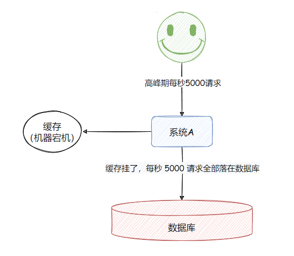

## 了解什么是 Redis 的雪崩、穿透和击穿？Redis 崩溃之后会怎么样？系统该如何应对这种情况？如何处理 Redis 的穿透？

### 缓存雪崩（Cache Avalanche）

- 【定义】由于缓存机器宕机，造成大量请求全部落在数据库的行为。

- 【场景】对于系统 A，假设每天高峰期每秒 5000 个请求，本来缓存在高峰期可以扛住每秒 4000 个请求，但是缓存机器意外发生了全盘宕机。缓存挂了，此时 1 秒 5000 个请求全部落数据库，数据库必然扛不住，它会报一下警，然后就挂了。此时，如果没有采用什么特别的方案来处理这个故障，DBA 很着急，重启数据库，但是数据库立马又被新的流量给打死了。

以上就是缓存雪崩。

- 缓存雪崩 事前、事中、事后的三种解决方案：
  - 事前：Redis 高可用，主从+哨兵，Redis cluster，避免全盘崩溃。
  - 事中：本地 ehcache 缓存 + Hystrix 限流&降级，避免 MySQL 被打死。
  - 事后：Redis 持久化（RDB/AOF），一旦重启，自动从磁盘上加载数据，快速恢复缓存数据。

### 缓存穿透（Cache Penetration）

- 【定义】如果在请求数据时，在缓存层和数据库层都没有找到符合条件的数据，也就是说，在缓存层和数据库层都没有命中数据，那么，这种情况就叫作缓存穿透。

- 【场景】对于系统 A，假设一秒 5000 个请求，结果其中 4000 个请求是黑客发出的恶意攻击。

  黑客发出的那 4000 个攻击，缓存中查不到，每次你去数据库里查，也查不到。

  举个栗子。数据库 id 是从 1 开始的，结果黑客发过来的请求 id 全部都是负数。这样的话，缓存中不会有，请求每次都“**视缓存于无物**”，直接查询数据库。这种恶意攻击场景的缓存穿透就会直接把数据库给打死。

- 【解决方案】既然我们知道了造成缓存穿透的主要原因就是缓存中不存在相应的数据，直接到数据库查询，数据库返回空结果，缓存中不存储空结果。

  解决方式很简单，每次系统 A 从数据库中只要没查到，就写一个空值到缓存里去，比如 `set -999 UNKNOWN` 。然后设置一个过期时间，这样的话，下次有相同的 key 来访问的时候，在缓存失效之前，都可以直接从缓存中取数据。

  当然，如果黑客如果每次使用不同的负数 id 来攻击，写空值的方法可能就不奏效了。更为经常的做法是在缓存之前增加布隆过滤器，将数据库中所有可能的数据哈希映射到**`布隆过滤器`**中。然后对每个请求进行如下判断：

  - 请求数据的 key 不存在于布隆过滤器中，可以确定数据就一定不会存在于数据库中，系统可以立即返回不存在。
  - 请求数据的 key 存在于布隆过滤器中，则继续再向缓存中查询。

  使用布隆过滤器能够对访问的请求起到了一定的初筛作用，避免了因数据不存在引起的查询压力。

### 缓存击穿（Hotspot Invalid）

- 【定义】缓存击穿，就是说某个 key 非常热点，访问非常频繁，处于集中式高并发访问的情况，当这个 key 在失效的瞬间，大量的请求就击穿了缓存，直接请求数据库，就像是在一道屏障上凿开了一个洞。
- 【不同场景下的解决方式可如下】：
  - 若缓存的数据是基本不会发生更新的，则可尝试将该热点数据设置为永不过期。
  - 若缓存的数据更新不频繁，且缓存刷新的整个流程耗时较少的情况下，则可以采用基于 Redis、zookeeper 等分布式中间件的分布式互斥锁，或者本地互斥锁以保证仅少量的请求能请求数据库并重新构建缓存，其余线程则在锁释放后能访问到新缓存。
  - 若缓存的数据更新频繁或者在缓存刷新的流程耗时较长的情况下，可以利用定时线程在缓存过期前主动地重新构建缓存或者延后缓存的过期时间，以保证所有的请求能一直访问到对应的缓存。

